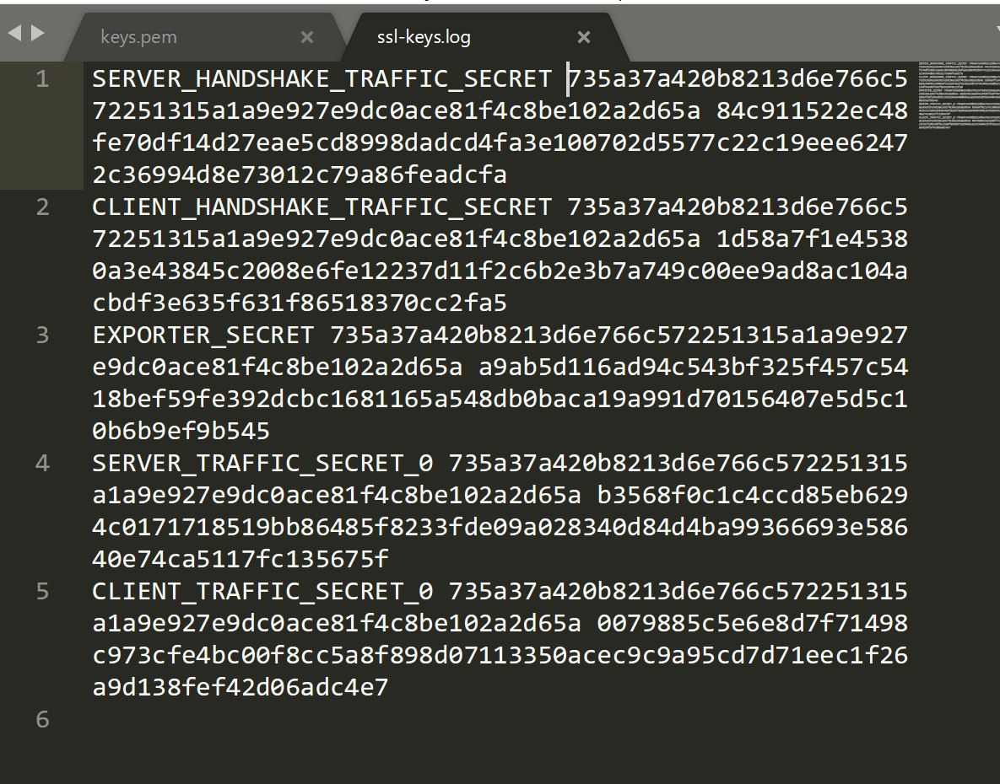

# Title

> Points: 359 [500]

## Description

> We know yakuhito's been playing in our internal network for over a year, but we never managed to kick him out. Last week, he made the big screen at the entrance play nyan cat.

## Solution

The pcap file given was a packet capture on the host machine.

From the endpoints shown above, we can see that there are only 3 local IPs in the packet capture, and only one of which is from another device in the network, <i>192.168.1.184</i>

So let's investigate packets exchanged with this IP.
<table>
    <tr>
        <td></td>
        <td>
    </tr>
</table>

From this we can see that the attacker is trying to get the host machine to update the cert and send a zip file over the encrypted network, which would then be unzipped and ran on the host machine. Thankfully, the RSA keys were also captured in the pcap file.
<table>
    <tr>
        <td></td>
        <td>
    </tr>
</table>

Loading it into wireshark under <b>Edit -> Preference -> Protocols -> TLS</b>, we got the decrypted traffic and extracted the zip file. The zip file contained a bash script which would play the nyan cat animation and at the bottom is the flag encoded in base64!

## Flag
`X-MAS{yeah_nyan_is_cool_but_have_you_ever_Y3VybCAtcyAtTCBiaXQubHkvMTBoQThpQyB8IGJhc2gK-ea8f6adb7605962d}`